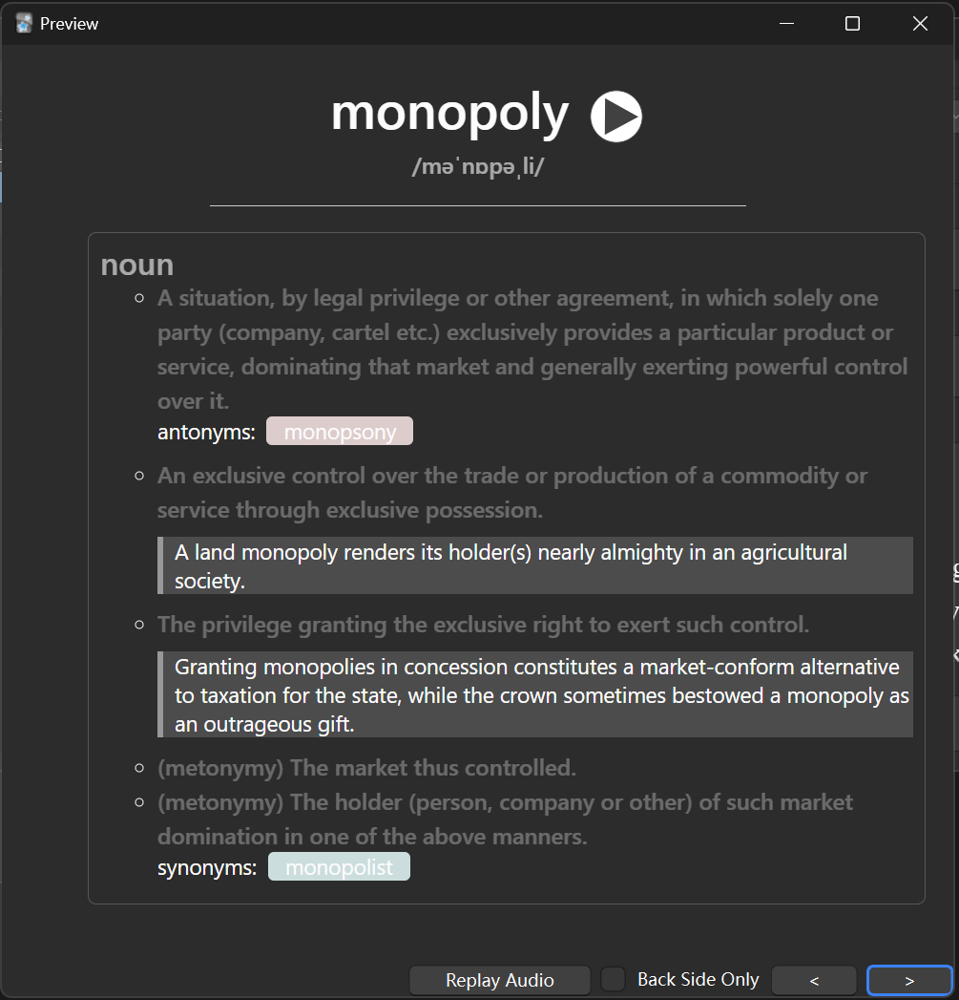

Inspire by [Make_Anki_Package](https://github.com/tongfeima/Make_Anki_Package), develop a small tool make batch of Anki card. 


# Preview

Front:


Back:




# Usage

Install package
```python
pip install .
```

put vocabulary into `wordlist.txt`

In bash just run
```
python demo.py
```
The `*.apkg` file is generated in the directory. 

The default card group name is English


# TODO

- make executable file


# Reference

- [Anki document](https://docs.ankiweb.net/templates/fields.html#field-references)
- [baicizhan API](https://github.com/lyc8503/baicizhan-word-meaning-API)
- [GenAnki](https://github.com/kerrickstaley/genanki)
- [FreeDictionaryAPI](https://github.com/meetDeveloper/freeDictionaryAPI)

# Copyright & license

